# EPLua Architecture

EPLua is a Python-based Lua execution engine with native UI support, async timers, and multiple communication interfaces. This document describes the system architecture, threading model, and component interactions.

## System Overview

EPLua consists of several key components that work together to provide a rich Lua execution environment:

- **Lua Engine**: Core script execution with async timer support
- **GUI System**: Native tkinter-based UI with thread-safe bridge
- **Web Server**: FastAPI-based HTTP API for remote control
- **Telnet Server**: Async REPL interface for interactive debugging
- **REPL Client**: Enhanced command-line interface with history and completion

## Threading Architecture

EPLua uses a multi-threaded architecture to separate concerns and provide responsive UI:

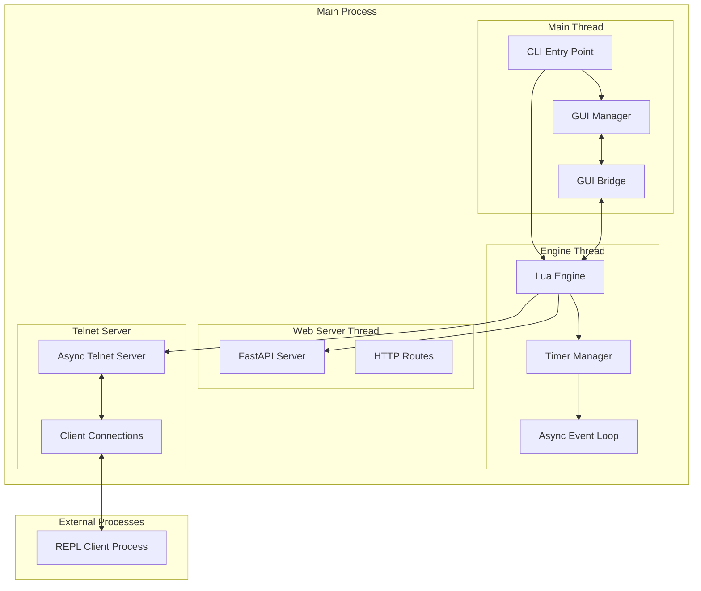

## Component Details

### 1. Lua Engine (`src/eplua/engine.py`)

The core execution engine that runs Lua scripts with Python integration:

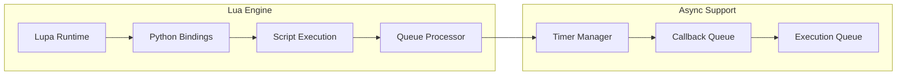

**Key Features:**
- Lupa-based Lua runtime with Python integration
- Async timer support with callback system
- Thread-safe script execution
- Queue-based communication between threads

### 2. GUI System (`src/eplua/gui_bridge.py`, `src/eplua/gui.py`)

Native tkinter-based UI with thread-safe communication:

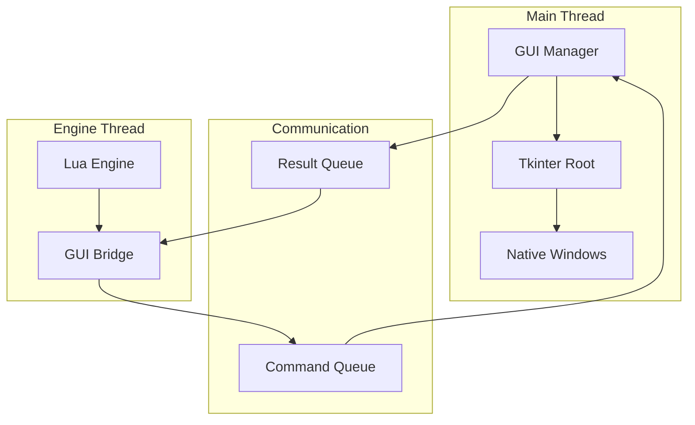

**Key Features:**
- Thread-safe bridge for GUI commands
- Native window creation and management
- Event-driven UI updates
- Queue-based command processing

### 3. Web Server (`src/eplua/web_server.py`)

FastAPI-based HTTP API for remote control and monitoring:

```mermaid
graph LR
    subgraph "Web Server Thread"
        FASTAPI[FastAPI App]
        ROUTES[HTTP Routes]
        UVICORN[Uvicorn Server]
    end
    
    subgraph "API Endpoints"
        ROOT[/]
        STATUS[/status]
        EXECUTE[/execute]
        CALLBACKS[/engine/callbacks]
    end
    
    subgraph "Engine Integration"
        LUA_ENGINE[Lua Engine]
        THREAD_EXEC[Thread Execution]
    end
    
    FASTAPI --> ROUTES
    ROUTES --> ROOT
    ROUTES --> STATUS
    ROUTES --> EXECUTE
    ROUTES --> CALLBACKS
    FASTAPI --> UVICORN
    EXECUTE --> THREAD_EXEC
    THREAD_EXEC --> LUA_ENGINE
    STATUS --> LUA_ENGINE
```

**Key Features:**
- RESTful API for script execution
- Real-time engine status monitoring
- JSON-based function calling
- Thread-safe execution integration

### 4. Telnet Server (`src/eplua/lua_bindings.py`)

Async telnet server for interactive REPL access:

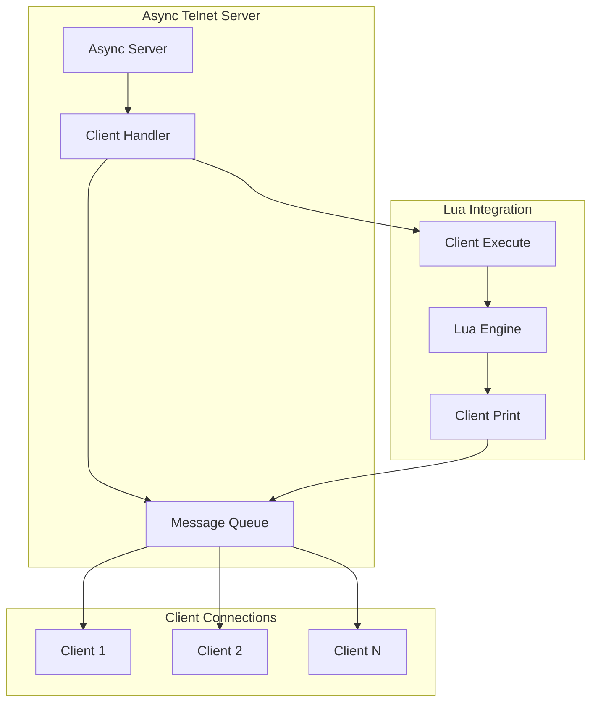

**Key Features:**
- Non-blocking async implementation
- Multiple client support
- Integrated with Lua print system
- Automatic stdout fallback

### 5. REPL Client (`src/eplua/repl.py`)

Enhanced command-line interface with advanced features:

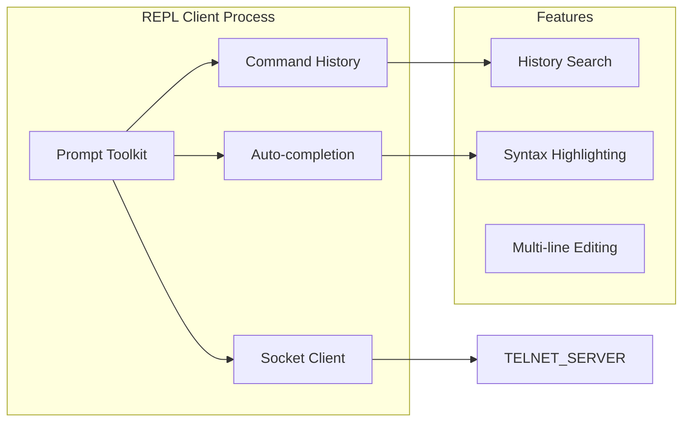

**Key Features:**
- Rich command-line interface with prompt_toolkit
- Command history and search
- Auto-completion for Lua functions
- Multi-line editing support

## Data Flow Diagrams

### 1. Script Execution Flow

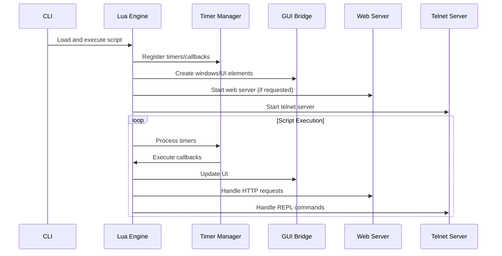

### 2. GUI Command Flow

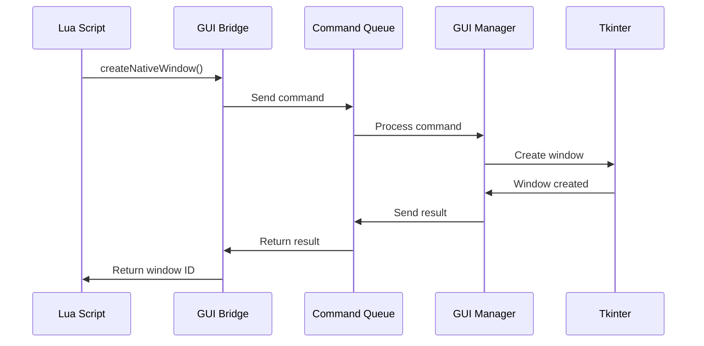

### 3. Web API Flow

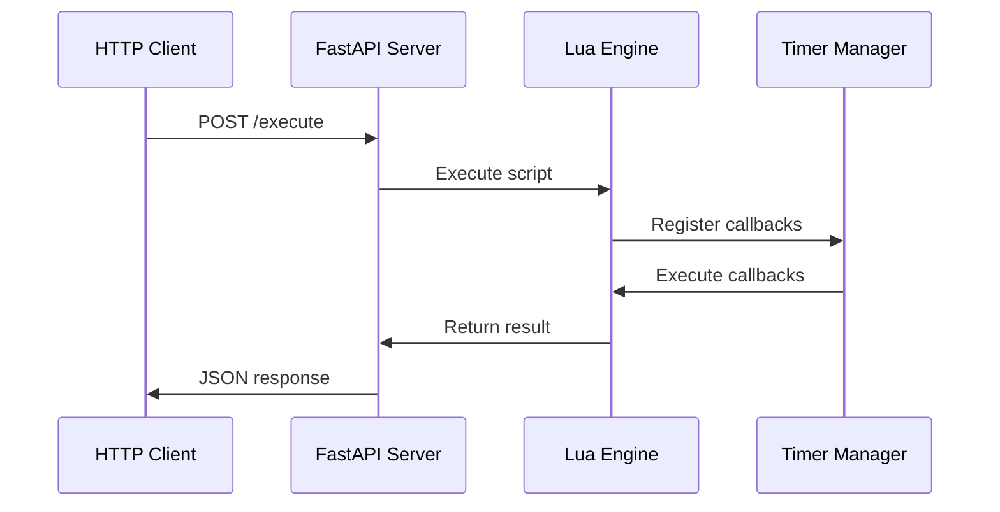

### 4. REPL Communication Flow

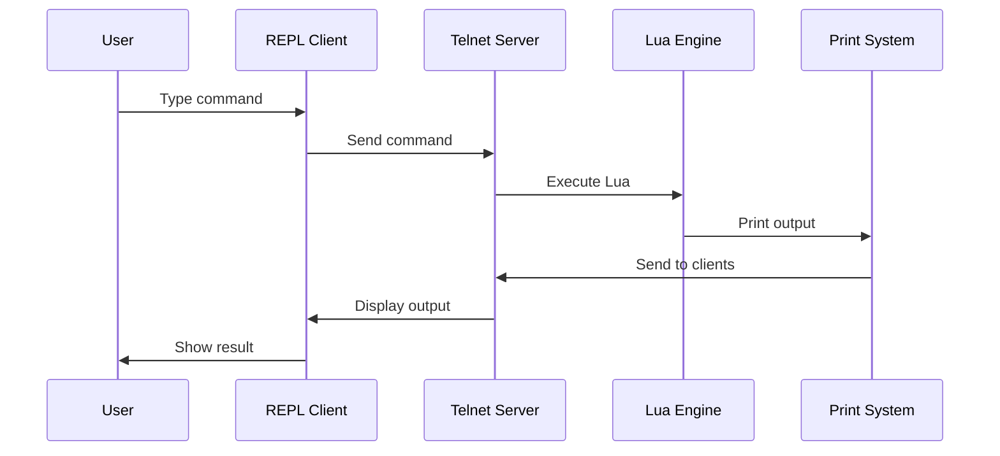

## Threading Model

### Thread Responsibilities

1. **Main Thread**: GUI management and user interaction
2. **Engine Thread**: Lua script execution and async operations
3. **Web Server Thread**: HTTP API handling
4. **Telnet Server**: Async REPL server (runs in engine thread)
5. **REPL Client Process**: Separate process for enhanced CLI

### Thread Communication

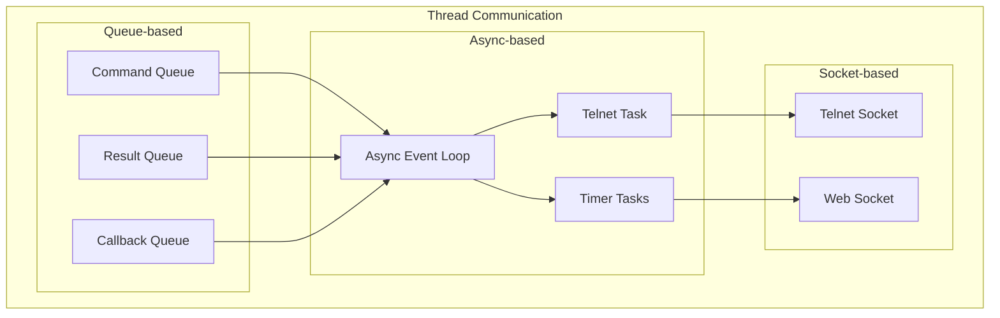

## Usage Patterns

### 1. Basic Script Execution

```bash
./run.sh script.lua
```

**Flow:**
1. CLI starts engine thread
2. Engine loads and executes script
3. Script runs with async timer support
4. Process exits when script completes

### 2. GUI Application

```bash
./run.sh gui_app.lua
```

**Flow:**
1. CLI starts GUI in main thread
2. Engine runs in worker thread
3. GUI bridge enables thread-safe communication
4. Lua creates native windows and UI elements

### 3. Web API Server

```lua
_PY.start_web_server("127.0.0.1", 8000)
```

**Flow:**
1. Lua starts web server in separate thread
2. FastAPI provides HTTP endpoints
3. External clients can execute Lua scripts
4. Results returned via JSON responses

### 4. Interactive REPL

```bash
./run.sh --interactive
```

**Flow:**
1. CLI starts telnet server
2. REPL client connects to telnet server
3. User types commands interactively
4. Results displayed in real-time

## Configuration and Extensions

### Configuration System

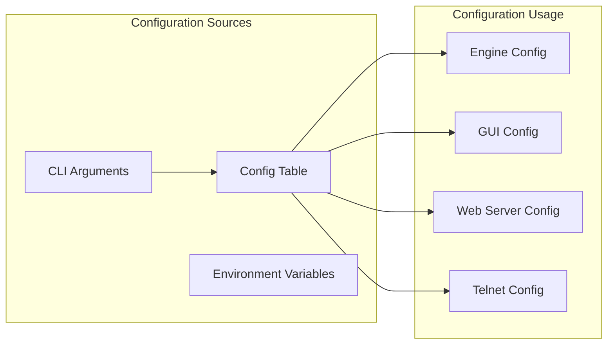

### Extension System

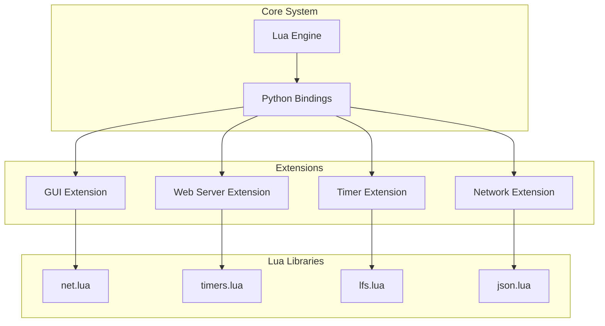

## Performance Considerations

### Memory Management

- **Lua Engine**: Uses Lupa for efficient Python-Lua integration
- **GUI Bridge**: Queue-based communication minimizes memory overhead
- **Async Operations**: Non-blocking I/O prevents memory leaks
- **Thread Safety**: Proper synchronization prevents race conditions

### Scalability

- **Multiple Clients**: Telnet server supports multiple concurrent connections
- **Web API**: FastAPI provides high-performance HTTP handling
- **Timer System**: Efficient async timer management for many concurrent timers
- **GUI Updates**: Batched updates reduce UI thread overhead

## Security Considerations

### Network Security

- **Telnet Server**: Binds to localhost only by default
- **Web Server**: Configurable host binding for network access
- **Client Validation**: Input validation for all external commands
- **Timeout Protection**: Script execution timeouts prevent hanging

### Script Security

- **Sandboxing**: Lua scripts run in controlled environment
- **Resource Limits**: Timer and callback limits prevent resource exhaustion
- **Error Handling**: Comprehensive error handling prevents crashes
- **Input Validation**: All external inputs are validated

## Future Enhancements

### Planned Features

1. **WebSocket Support**: Real-time bidirectional communication
2. **Plugin System**: Dynamic loading of Python extensions
3. **Distributed Mode**: Multi-node EPLua clusters
4. **Performance Profiling**: Built-in performance monitoring
5. **Advanced Debugging**: Integrated debugger with breakpoints

### Architecture Evolution

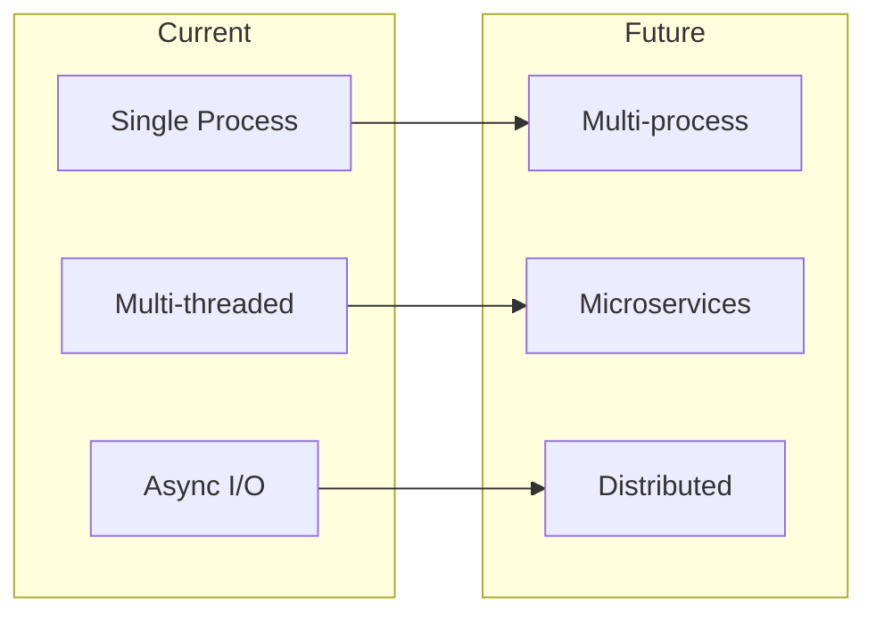

This architecture provides a solid foundation for building complex Lua applications with rich UI, network capabilities, and high performance while maintaining simplicity and extensibility. 